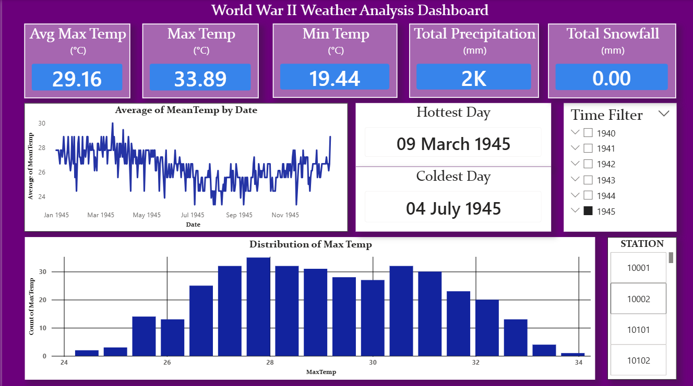

# World War II Weather Analysis & Temperature Prediction

An end-to-end data science and analytics project analyzing historical World War II weather station data to predict maximum temperatures (**MaxTemp**) and deliver key weather insights through an interactive dashboard.

---

## Dashboard Preview

> *Visualizing weather trends, stations, and predictive insights across historical WW2 data.*

 

---

## Project Overview

This project focuses on modeling historical weather data recorded during World War II. The primary objective is to predict maximum daily temperatures based on atmospheric conditions and historical measurements. 

### Key Workflow Steps:
1. **Data Cleaning & Preprocessing:** Handling missing values, removing outliers, and structuring temporal features.
2. **Feature Engineering:** Creating relevant features to enhance predictive performance.
3. **Model Training & Evaluation:** Implementing regression algorithms to accurately predict `MaxTemp`.
4. **Interactive Visualization:** Building a Power BI dashboard for intuitive data exploration.

---
